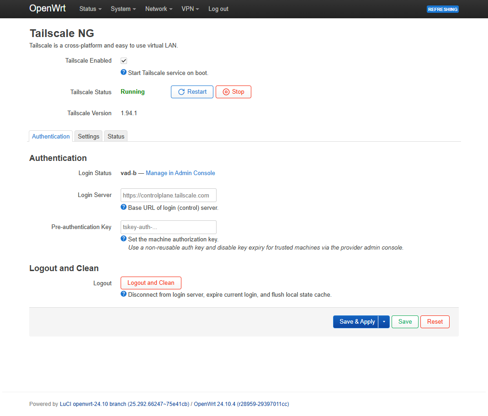
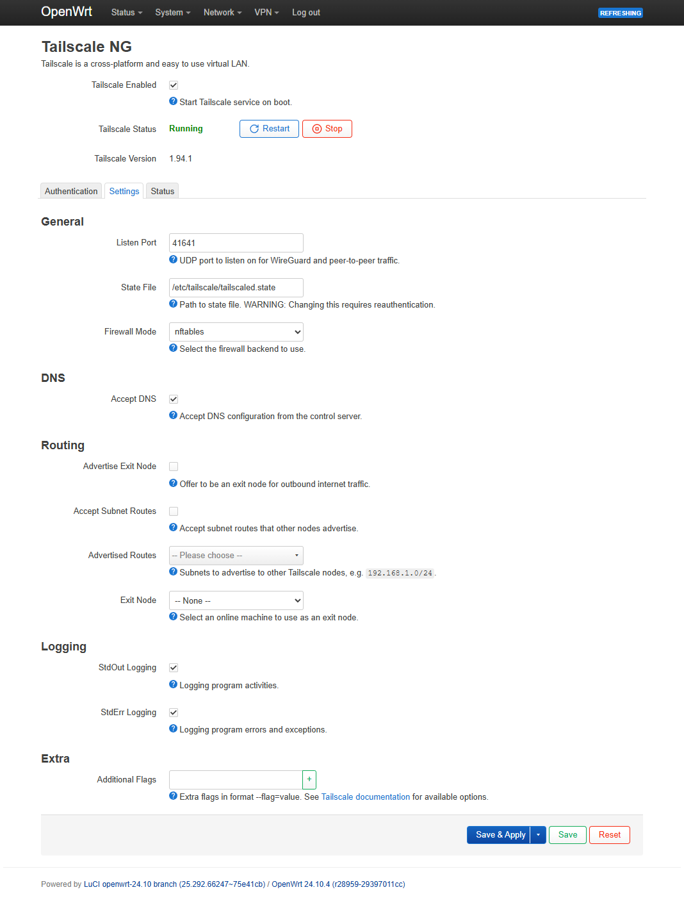
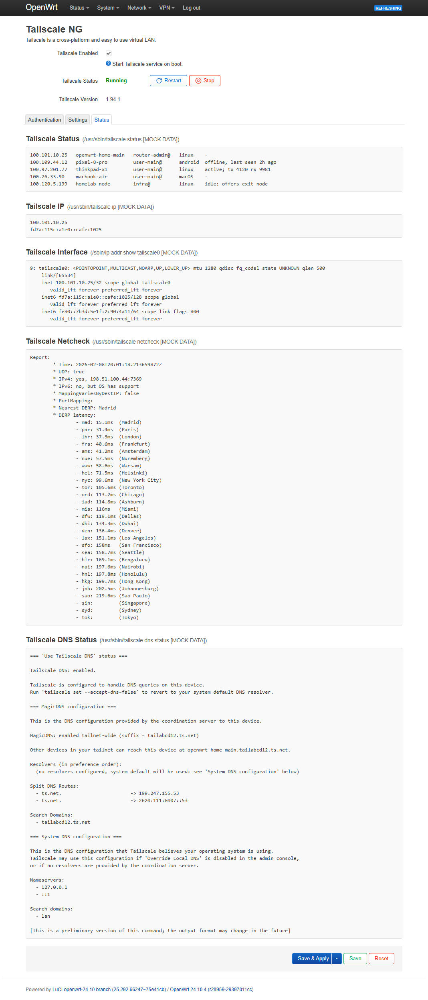

# luci-app-tailscale-ng

LuCI web interface for managing [Tailscale](https://tailscale.com/) on OpenWrt routers.

Inspired by [asvow/luci-app-tailscale](https://github.com/asvow/luci-app-tailscale), this project is a major redesign that eliminates conflicts with the standard OpenWrt `tailscale` package. See [Motivation](#motivation) for details.

## Quick Install

Auto-detects `opkg` / `apk` and installs the latest release:

```shell
wget -qO- https://raw.githubusercontent.com/vad-b/luci-app-tailscale-ng/main/install.sh | sh
```

After installation, navigate to **VPN -> Tailscale NG** in the LuCI web interface.

Need manual package install options instead? See [Manual Installation](#manual-installation).

## Screenshots

<table style="width: 100%; table-layout: fixed;">
  <tr>
    <td align="center" valign="top" width="33.33%"><strong>Authentication</strong></td>
    <td align="center" valign="top" width="33.33%"><strong>Settings</strong></td>
    <td align="center" valign="top" width="33.33%"><strong>Status</strong></td>
  </tr>
  <tr>
    <td valign="top" width="33.33%"></td>
    <td valign="top" width="33.33%"></td>
    <td valign="top" width="33.33%"></td>
  </tr>
</table>

## Motivation

### Problem

The original [asvow/luci-app-tailscale](https://github.com/asvow/luci-app-tailscale) project is excellent and inspired this work, but its integration model is tightly coupled to core files from the OpenWrt `tailscale` package, which leads to three operational drawbacks:

- **Invasive install:** During installation, `asvow/luci-app-tailscale` replaces core `tailscale` files (`/etc/init.d/tailscale` and `/etc/config/tailscale`) and takes ownership of them.
- **Breaking uninstallation:** When `asvow/luci-app-tailscale` is removed, those same files are deleted, leaving the stock `tailscale` package non-functional.
- **Restore normal operation:** To recover normal Tailscale operation, you must recreate the removed files manually or reinstall the `tailscale` package.

See [asvow/luci-app-tailscale#31](https://github.com/asvow/luci-app-tailscale/issues/31) for details.

### Solution

The goals of `luci-app-tailscale-ng` are:

- keep integration non-conflicting with the standard OpenWrt `tailscale` package
- make the OpenWrt Tailscale UI closer to the Tailscale management UI in pfSense and OPNsense

## How it works

**luci-app-tailscale-ng** takes a non-invasive approach:

- **Does not replace** any files from the `tailscale` package - the original `/etc/init.d/tailscale` and `/etc/config/tailscale` remain untouched
- **Adds its own** UCI config (`/etc/config/luci-app-tailscale-ng`) and init script (`/etc/init.d/luci-app-tailscale-ng`) that work alongside the standard ones
- **Manages `tailscale up` parameters** by reading settings from its own config and applying them via the `tailscale` CLI
- **Combines two configs** in the UI - settings from the standard `tailscale` config (port, state file, firewall mode, logging) and our extended config (auth, DNS, routing, exit nodes) are presented on a single page

This means you can install and remove the package at any time without breaking your Tailscale setup.

## Features

- Enable/disable Tailscale service with auto-start on boot
- Configure listen port, state file path, firewall mode
- Login status with one-click authentication link
- Configure control server URL and pre-authentication keys
- Accept DNS / Accept subnet routes
- Advertise as exit node or select a remote exit node (with auto-detection of exit nodes)
- Advertise local subnets (with auto-detection of LAN/WAN networks)
- Pass additional `tailscale up` flags
- Live status dashboard (tailscale status, IP, interface, netcheck, DNS)
- Automatic settings reapply on network interface changes via hotplug

> **Right now** this package provides Tailscale management in LuCI (service control, `tailscale up` settings, and status visibility). It does **not** automatically create Tailscale interfaces or firewall rules yet. See [Roadmap](#roadmap) for planned automation.

## Roadmap

- Auto-create network interfaces and firewall zones/rules for Tailscale
- Import existing Tailscale settings on first install (read current running parameters and populate the config)
- Backup and restore of the Tailscale state file
- Update Tailscale directly from the web UI (both standard and size-optimized builds for memory-constrained devices)

## Manual Installation

### Install with `opkg` (`.ipk`)

Download the latest `.ipk` package from [Releases](https://github.com/vad-b/luci-app-tailscale-ng/releases), upload it to the router's `/tmp` directory, then:

```shell
opkg install /tmp/luci-app-tailscale-ng_*.ipk
```

### Install with `apk` (`.apk`)

Download the latest `.apk` package from [Releases](https://github.com/vad-b/luci-app-tailscale-ng/releases), upload it to the router's `/tmp` directory, then:

```shell
apk add --allow-untrusted --upgrade /tmp/luci-app-tailscale-ng_*.apk
```

## Credits

- [asvow/luci-app-tailscale](https://github.com/asvow/luci-app-tailscale) - the project that inspired this work

## License

[GPL-3.0](LICENSE)
